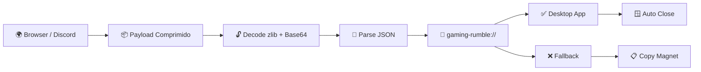

# 🌐 Gaming Rumble (GR-Link)

<p align="center">
  
</p>

<br>

> Ponte inteligente entre navegador e aplicativo desktop do Gaming Rumble, responsável por decodificar payloads comprimidos, abrir o app automaticamente e fornecer fallback elegante quando o client não está instalado.

## ✨ Snapshot Do Projeto

| Frontend | Runtime | UI | Deep Link | Status |
|:---:|:---:|:---:|:---:|:---:|
|  |  |  |  |  |

---

## 📋 Índice

<details open>
<summary><b>Clique para expandir/recolher</b></summary>

- 📖 [Sobre o Projeto](#-sobre-o-projeto)
- ✨ [Funcionalidades](#-funcionalidades)
- 🧱 [Arquitetura](#-arquitetura)
- 🚀 [Pré-requisitos](#-pré-requisitos)
- 📦 [Instalação](#-instalação)
- 💻 [Executando o Projeto](#-executando-o-projeto)
- 🧪 [Build de Produção](#-build-de-produção)
- 📡 [Como Funciona o Deep Link](#-como-funciona-o-deep-link)
- 🧩 [Exemplo de Payload](#-exemplo-de-payload)
- 🗂️ [Estrutura do Projeto](#️-estrutura-do-projeto)
- 🤝 [Contribuindo](#-contribuindo)
- 📄 [Licença](#-licença)

</details>

---

## 📖 Sobre o Projeto

O GR-Link é o intermediário web do ecossistema Gaming Rumble.

Ele atua como ponte entre:

- navegador
- Discord
- links compartilhados
- protocolo desktop `gaming-rumble://`

O objetivo do projeto é eliminar atrito no fluxo de instalação.

Quando o usuário acessa um link compatível:

- O payload compactado é recebido via URL
- O JSON é decodificado automaticamente
- O sistema tenta abrir o client desktop
- Caso o app não exista, o usuário recebe fallback visual
- O magnet link continua acessível manualmente

---

## ✨ Funcionalidades

| Feature | Descrição |
|---|---|
| Deep Link | Integração automática com `gaming-rumble://` |
| zlib + Base64 | Payload comprimido e URL-safe |
| Auto Open | Tentativa automática de abrir o app |
| Smart Fallback | Fallback elegante quando o app não existe |
| Copy Magnet | Botão para copiar magnet link |
| Auto Close | Fecha a aba automaticamente após abertura |
| Responsive UI | Compatível com desktop e mobile |
| Multi-State UI | Loading, fallback, opened, error e invalid payload |
| Animated Interface | UI dark com animações e glow effects |

---

## 🧱 Arquitetura



---

## 🚀 Pré-requisitos

| Dependência | Necessária |
|---|---|
| Node.js >= 18 | Sim |
| npm ou Bun | Sim |

---

## 📦 Instalação

### Clone o repositório

```bash
git clone https://github.com/seu-usuario/gr-link.git
```

### Entre na pasta

```bash
cd gr-link
```

### Instale as dependências

```bash
npm install
```

ou

```bash
bun install
```

---

## 💻 Executando o Projeto

### Ambiente de desenvolvimento

```bash
npm run dev
```

ou

```bash
bun dev
```

O servidor local será iniciado em:

```txt
http://localhost:8080
```

---

## 🧪 Build de Produção

### Build final

```bash
npm run build
```

### Preview local

```bash
npm run preview
```

### Build debug

```bash
npm run build:dev
```

Output final:

```txt
dist/
```

---

## 📡 Como Funciona o Deep Link

### URL de acesso

```txt
https://gr-link.site/?data=<compressed_payload>
```

### Fluxo interno

```txt
1. Usuário abre o link
2. O payload Base64 é lido
3. O zlib é descompactado
4. O JSON do jogo é parseado
5. O GR-Link tenta abrir gaming-rumble://
6. Se o app existir:
   → o app abre
   → a aba fecha automaticamente

7. Se o app não existir:
   → fallback visual é exibido
   → usuário pode copiar magnet link
```

---

## 🧩 Exemplo de Payload

### Exemplo expandido

```json
{
  "title": "Cyberpunk 2077",
  "banner": "https://cdn.example.com/banner.jpg",
  "parts": 3,
  "fileSize": "65.2 GB",
  "magnet": "magnet:?xt=urn:btih:..."
}
```

### Chaves compactadas

| Curta | Completa |
|---|---|
| `t` | `title` |
| `b` | `banner` |
| `p` | `parts` |
| `s` | `fileSize` |
| `m` | `magnet` |

---

## 🗂️ Estrutura do Projeto

```txt
gr-link/
├── src/
│   ├── assets/
│   ├── components/
│   │   └── ui/
│   ├── pages/
│   │   ├── Index.tsx
│   │   └── NotFound.tsx
│   ├── lib/
│   ├── App.tsx
│   ├── main.tsx
│   └── index.css
├── public/
├── vite.config.ts
├── tailwind.config.ts
├── eslint.config.js
└── package.json
```

### Visão rápida das pastas

| Caminho | Finalidade |
|---|---|
| `src/pages/` | Fluxo principal da aplicação |
| `src/components/` | Componentes reutilizáveis |
| `src/lib/` | Utilitários e helpers |
| `index.css` | Variáveis e animações |
| `vite.config.ts` | Configuração do Vite |
| `components.json` | Configuração shadcn/ui |

---

## 🤝 Contribuindo

Fluxo recomendado:

```txt
Fork
 → Feature Branch
 → Commit
 → Pull Request
```

---

## 📄 Licença

Este projeto é distribuído sob a licença MIT.

Veja mais detalhes em `LICENSE`.
