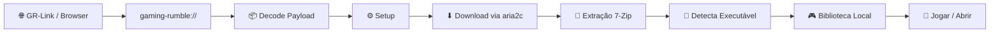

# 🎮 Gaming Rumble (Desktop Client)

<p align="center">
  
</p>

<br>

> Cliente desktop construído com Tauri para consumir payloads compatíveis, baixar jogos via magnet link, extrair automaticamente e organizar a biblioteca local no Windows.

## ✨ Snapshot Do Projeto

| Plataforma | Engine | Frontend | Runtime | Status |
|:---:|:---:|:---:|:---:|:---:|
|  |  |  |  |  |

---

## 📌 O Que Este Repositório Faz

O Gaming Rumble é o client desktop principal do ecossistema.

Ele automatiza todo o fluxo de instalação dos jogos:

- Recebe payloads via protocolo `gaming-rumble://`
- Decodifica informações do jogo em Base64
- Executa downloads via BitTorrent usando `aria2c`
- Extrai automaticamente os arquivos do jogo
- Detecta executáveis principais
- Organiza a biblioteca local
- Cria atalhos automaticamente
- Mantém gerenciamento persistente da biblioteca

O foco do projeto é reduzir atrito e automatizar processos repetitivos.

---

## ⚠️ Compatibilidade

> [!WARNING]
> Este client foi desenvolvido especificamente para o ecossistema Gaming Rumble.
>
> Atualmente o fluxo suportado é baseado no indexador vindo de `online-fix.me`.
>
> Magnet links aleatórios ou payloads externos podem não funcionar corretamente.
>
> Não existe garantia de compatibilidade fora do fluxo oficial do projeto.

---

## 🧭 Fluxo Completo Do Produto



---

## ✨ Recursos Principais

| Feature | Descrição |
|---|---|
| `gaming-rumble://` | Protocolo customizado para instalação automática |
| Download BitTorrent | Download com progresso em tempo real |
| Biblioteca Persistente | Jogos instalados ficam registrados localmente |
| Auto Extract | Extração automática pós-download |
| Fix Only | Baixa apenas o fix quando necessário |
| Auto Shortcut | Cria atalhos automaticamente |
| Resume Support | Pausa e retomada de download |
| Disk Validation | Verifica espaço disponível antes da instalação |
| Error Handling | Tratamento separado para download e extração |
| Executable Detection | Detecta automaticamente o executável principal |

---

## 🧠 Como O Fluxo Funciona

### Payload

O navegador ou app intermediário envia um payload Base64:

```json
{
  "title": "Nome do Jogo",
  "banner": "https://shared.akamai.steamstatic.com/.../header.jpg",
  "parts": 4,
  "fileSize": "551.10 MB",
  "magnet": "magnet:?xt=urn:btih:..."
}
```

### Fluxo interno

```txt
1. Browser abre gaming-rumble://
2. Tauri recebe a URI
3. Payload é decodificado
4. Usuário confirma instalação
5. aria2c inicia o torrent
6. 7-Zip extrai os arquivos
7. O executável principal é detectado
8. O jogo entra na biblioteca
9. Atalhos são criados automaticamente
```

---

## 🧱 Stack Atual

### Base do projeto

<table align="center">
  <tr>
    <td align="center">
      <br>
      <strong>React 19</strong>
    </td>
    <td align="center">
      <br>
      <strong>TypeScript</strong>
    </td>
    <td align="center">
      <br>
      <strong>Tauri 2</strong>
    </td>
    <td align="center">
      <br>
      <strong>Tailwind 4</strong>
    </td>
    <td align="center">
      <br>
      <strong>Rust</strong>
    </td>
  </tr>
</table>

---

## 📦 Binários Externos

| Binário | Status | Finalidade |
|---|---|---|
| `aria2c.exe` | Bundled | Download BitTorrent |
| `7-ZIP/` | Bundled | Extração de arquivos |
| `WebView2` | Runtime | Renderização da UI |

---

## 🖥️ Plataforma Suportada

| Sistema | Status |
|---|---|
| Windows 10 | ✅ Suportado |
| Windows 11 | ✅ Suportado |
| Linux | ❌ Não suportado oficialmente |
| macOS | ❌ Não suportado oficialmente |

> O projeto atual foi desenvolvido e empacotado exclusivamente com foco em Windows.

---

## 🗂️ Estrutura Do Projeto

```txt
Gaming Rumble/
├── src/
│   ├── App.tsx
│   ├── payload.ts
│   ├── types.ts
│   └── components/
│       ├── Layout/
│       └── Views/
├── src-tauri/
│   ├── src/
│   │   └── commands/
│   └── tauri.conf.json
├── public/
├── .github/workflows/
└── README.md
```

### Visão rápida das pastas

| Caminho | Conteúdo |
|---|---|
| `src/` | Frontend React |
| `src/components/Views/` | Telas do aplicativo |
| `src-tauri/src/commands/` | Comandos nativos em Rust |
| `payload.ts` | Decode e parsing do protocolo |
| `tauri.conf.json` | Configuração principal |
| `.github/workflows/` | Build e release CI/CD |

---

## ⚙️ Configuração Local

### Pré-requisitos

| Ferramenta | Necessária |
|---|---|
| Node.js LTS | Sim |
| Rust / rustup | Sim |
| Windows 10/11 | Sim |

---

## 🚀 Desenvolvimento

### Instalar dependências

```bash
npm install
```

### Rodar ambiente local

```bash
npm run tauri dev
```

### Gerar build local

```bash
npm run tauri build
```

---

## 📦 Build E Release

### Saídas locais

Os builds são gerados em:

```txt
src-tauri/target/release/bundle/msi/
src-tauri/target/release/bundle/nsis/
```

### Pipeline CI/CD

O workflow da branch `main`:

- instala Node.js
- instala Rust stable
- instala WebView2
- gera build Tauri
- publica artefatos
- cria releases automaticamente

---

## 🧠 Comportamentos Técnicos

| Sistema | Função |
|---|---|
| Download State | Persistência local de progresso |
| Event System | Eventos Tauri para logs e progresso |
| Library Manager | Gerenciamento local da biblioteca |
| Extract Pipeline | Pipeline separada de extração |
| Launcher Detection | Busca automática do executável |

---

## 🛠️ Notas Operacionais

- O app utiliza janela customizada sem decoração nativa
- O estado dos downloads sobrevive a reload durante desenvolvimento
- A biblioteca é mantida localmente pelo client
- O fluxo foi desenhado para integração com o ecossistema Gaming Rumble
- O projeto não pretende ser um client torrent genérico

---

## ⚠️ Aviso Legal

> [!WARNING]
> Este software é fornecido **"AS IS"**, sem garantias de qualquer tipo.
>
> - O projeto não hospeda conteúdo protegido
> - O app apenas automatiza download, extração e gerenciamento
> - Não existe suporte para conteúdo acessado pelo usuário
> - O uso é por conta e risco do usuário final
> - Toda responsabilidade sobre conteúdo acessado pertence ao usuário

---

## 📜 Licença

Este repositório é disponibilizado apenas para fins educacionais e de pesquisa.

Veja a licença completa e o aviso legal em `LICENSE`.
