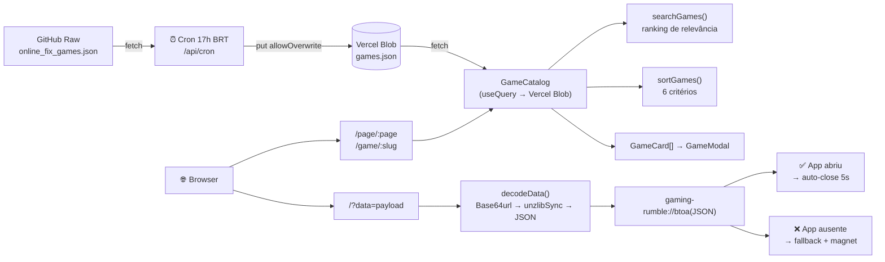
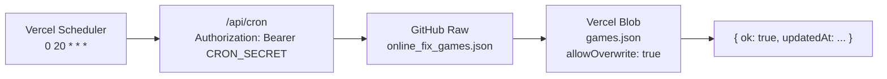

# 🎮 Gaming Rumble (GR-Link)

<p align="center">
  
</p>
<br>

> Site do Gaming Rumble — catálogo de jogos com busca, filtros e paginação, integrado ao app desktop via protocolo customizado `gaming-rumble://` para download direto com um clique.


## 📋 Índice

<details open>
<summary><b>Clique para expandir/recolher</b></summary>

- 📌 [O Que Este Site Faz](#-o-que-este-site-faz)
- 🔀 [Rotas](#-rotas)
- 🧱 [Arquitetura](#-arquitetura)
- 📡 [Como Funciona o Deep Link](#-como-funciona-o-deep-link)
- ⏰ [Cron de Atualização do Catálogo](#-cron-de-atualização-do-catálogo)
- 🌍 [Variáveis de Ambiente](#-variáveis-de-ambiente)
- ⚙️ [Configuração Local](#️-configuração-local)
- 🚀 [Uso](#-uso)
- 📁 [Estrutura do Projeto](#-estrutura-do-projeto)
- 📜 [Licença](#-licença)

</details>

---

## 📌 O Que Este Site Faz

O GR-Link é o frontend do ecossistema Gaming Rumble.

Ele tem dois papéis:

**Catálogo**

- Exibe todos os jogos indexados pelo Scrapper
- Busca com ranking de relevância (exato > prefixo > palavra > parcial)
- Filtros de ordenação: A→Z, Z→A, mais recente, mais antigo, maior, menor
- Paginação via URL (`/page/:page`) com clamping automático
- Modal com requisitos do sistema (EN→PT), arquivos incluídos, preço Steam e compartilhamento
- URLs canônicas por jogo (`/game/:slug`)

**Ponte de Deep Link**

- Recebe payload comprimido (zlib + Base64url) via parâmetro `?data=`
- Decodifica e tenta abrir o app nativo via `gaming-rumble://`
- Fallback visual após 1,5s quando o app não está instalado
- Fecha a aba automaticamente 5s após o app abrir
- Link `?download` em qualquer jogo gera o payload e dispara o protocolo

---

## 🔀 Rotas

| Rota | Comportamento |
|---|---|
| `/` | Redireciona para `/page/1` quando não há payload |
| `/?data=<payload>` | Deep link — decodifica e abre o app |
| `/page/:page` | Catálogo paginado |
| `/game/:slug` | Catálogo com modal do jogo aberto |
| `/game/:slug?download` | Codifica o jogo e redireciona para `/?data=` |

> [!NOTE]
> Páginas fora do intervalo válido são redirecionadas automaticamente para a última página disponível.

---

## 🧱 Arquitetura



---

## 📡 Como Funciona o Deep Link

### URL de acesso

```
https://seusite.com/?data=<zlib_base64url_encoded_json>
```

O payload contém os dados do jogo comprimidos com zlib e codificados em Base64 URL-safe:

| Chave curta | Chave completa | Exemplo |
|---|---|---|
| `t` | `title` | `"Cyberpunk 2077"` |
| `b` | `banner` | `"https://cdn.exemplo.com/banner.jpg"` |
| `p` | `parts` | `3` |
| `s` | `fileSize` | `"65.2 GB"` |
| `m` | `magnet` | `"magnet:?xt=urn:btih:..."` |

### Fluxo completo

```
1. Usuário acessa /game/cyberpunk-2077?download
2. GR-Link localiza o jogo pelo slug
3. Codifica: JSON → zlib → Base64url → redireciona para /?data=...
4. Exibe banner, título, tamanho e número de arquivos
5. Tenta abrir gaming-rumble://base64_json
   │
   ├─ ✅ App instalado → fecha aba em 5s
   └─ ❌ App ausente  → botão "Abrir no App" + copiar Magnet
```

<details>
<summary><strong>Como gerar um payload manualmente</strong></summary>

Execute no console do navegador (F12):

```javascript
// fflate já está incluso no projeto
import { zlibSync } from 'fflate';

const game = {
  t: "Meu Jogo",
  b: "https://via.placeholder.com/800x400",
  p: 2,
  s: "45.5 GB",
  m: "magnet:?xt=urn:btih:exemplo"
};

const bytes = new TextEncoder().encode(JSON.stringify(game));
const compressed = zlibSync(bytes);
const b64 = btoa(String.fromCharCode(...compressed));
const urlSafe = b64.replace(/\+/g, '-').replace(/\//g, '_').replace(/=+$/, '');

console.log(`http://localhost:8080/?data=${urlSafe}`);
```

</details>

---

## ⏰ Cron de Atualização do Catálogo

O catálogo é sincronizado automaticamente **todo dia às 17h (BRT / 20h UTC)** via função serverless na Vercel.



> [!NOTE]
> O endpoint `/api/cron` pode ser chamado manualmente com o header `Authorization: Bearer <CRON_SECRET>` para forçar uma sincronização imediata.

---

## 🌍 Variáveis de Ambiente

Configure no painel da Vercel em **Settings → Environment Variables**:

| Variável | Obrigatória | Descrição |
|---|---|---|
| `BLOB_READ_WRITE_TOKEN` | ✅ | Token de leitura/escrita do Vercel Blob — gerado em **Storage → seu blob → Settings** |
| `CRON_SECRET` | ✅ | Segredo arbitrário injetado automaticamente pela Vercel no header `Authorization` de cada invocação do cron |

> [!WARNING]
> Sem o `BLOB_READ_WRITE_TOKEN` o cron falha ao sobrescrever o `games.json`. Sem o `CRON_SECRET` a rota `/api/cron` retorna `401` para qualquer requisição.

---

## ⚙️ Configuração Local

### Requisitos

| Ferramenta | Versão |
|---|---|
| Node.js | `>= 18` |
| Bun | `>= 1.0` |

### Instalação

```bash
git clone https://github.com/zKauaFerreira/The-Gaming-Rumble.git
cd The-Gaming-Rumble
git checkout gr-link-site
bun install
```

---

## 🚀 Uso

### Desenvolvimento

```bash
bun dev
```

> Servidor em `http://localhost:8080` com HMR ativado.

### Build de produção

```bash
bun run build
bun run preview
```

### Verificação de tipos

```bash
bun run tsc --noEmit
```

---

## 📁 Estrutura do Projeto

```txt
gr-link/
├── api/
│   └── cron.ts                  # Serverless function — sincroniza games.json no Vercel Blob
├── src/
│   ├── assets/
│   │   └── icon.png
│   ├── components/
│   │   ├── GameCatalog.tsx       # Catálogo completo (busca, filtros, paginação, modal)
│   │   ├── GameModal.tsx         # Modal de detalhes do jogo
│   │   └── ui/                  # Componentes shadcn/ui
│   ├── pages/
│   │   ├── Index.tsx             # Deep link — decode + protocolo + fallback
│   │   └── NotFound.tsx
│   ├── lib/
│   │   ├── games.ts              # Tipos, slugify, sort, search, encode
│   │   ├── translations.json     # Traduções EN→PT para requisitos de sistema
│   │   └── utils.ts
│   ├── App.tsx
│   ├── index.css
│   └── main.tsx
├── public/
├── vercel.json                   # Cron schedule + rewrites SPA
├── vite.config.ts
├── tailwind.config.ts
└── package.json
```

---

## 📜 Licença

Este repositório é disponibilizado apenas para fins educacionais e de pesquisa.

Veja a licença completa e o aviso legal em [LICENSE](https://github.com/zKauaFerreira/The-Gaming-Rumble/blob/main/LICENSE).
