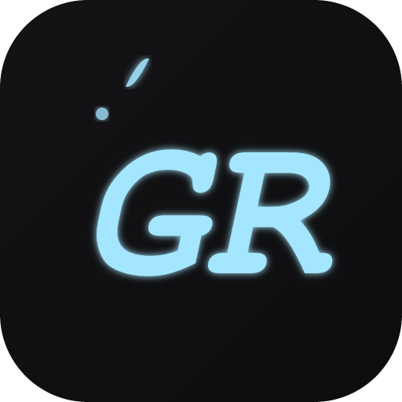

<div align="center">

[](#)

# 🎮 GR-Link

> **A ponte inteligente entre a web e o Gaming Rumble App** — decodifica dados de jogos comprimidos, tenta abrir o app nativo automaticamente e oferece fallback elegante quando o app não está instalado.

[](https://react.dev/)
[](https://www.typescriptlang.org/)
[](https://vitejs.dev/)
[](https://tailwindcss.com/)
[](https://ui.shadcn.com/)
[](https://bun.sh/)
[](https://nodejs.org/)

[](https://github.com/)
[](#-licença)
[](#-contribuindo)
[](.)

</div>

---

## 📋 Índice

<details open>
<summary><b>Clique para expandir/recolher</b></summary>

- 📖 [Sobre o Projeto](#-sobre-o-projeto)
- ✨ [Funcionalidades](#-funcionalidades)
- 🧱 [Arquitetura](#-arquitetura)
- 🚀 [Pré-requisitos](#-pré-requisitos)
- 📦 [Instalação](#-instalação)
- 💻 [Executando o Projeto](#-executando-o-projeto)
- 🧪 [Build de Produção](#-build-de-produção)
- 📡 [Como Funciona o Deep Link](#-como-funciona-o-deep-link)
- 🧩 [Exemplo de Payload](#-exemplo-de-payload)
- 🗂️ [Estrutura do Projeto](#️-estrutura-do-projeto)
- 🤝 [Contribuindo](#-contribuindo)
- 📄 [Licença](#-licença)

</details>

---

## 📖 Sobre o Projeto

O **GR-Link** é uma aplicação web que atua como **intermediário inteligente** entre o navegador e o aplicativo desktop **Gaming Rumble**. Quando um usuário clica em um link de jogo compartilhado:

1. 📥 O GR-Link recebe dados do jogo **comprimidos com zlib e codificados em Base64** via parâmetro URL
2. 🔓 Decodifica e descomprime os dados automaticamente (`fflate`)
3. 🚀 Tenta abrir o app nativo via protocolo customizado `gaming-rumble://`
4. ⏱️ Se o app não está instalado, oferece **fallback** com botão "Abrir no App" + cópia do Magnet Link

> 💡 **Por quê?** Elimina a fricção de copiar/colar links de jogo — o usuário acessa diretamente do navegador ao app!

---

## ✨ Funcionalidades

| Feature | Descrição |
|:---:|---|
| 🔐 | **Decodificação zlib+Base64** — dados compactados e seguros via URL |
| 🚀 | **Auto-open via `custom protocol`** — tentativa automática de abrir o app nativo |
| 🎨 | **UI temática dark** — design moderno com gradientes, glow e animações CSS custom |
| 📋 | **Copy Magnet Link** — botão para copiar o link magnet com feedback visual |
| ⏱️ | **Fallback inteligente** — detecta se o app não abriu e mostra alternativas em 1.5s |
| 🪟 | **Auto-close tab** — fecha a aba automaticamente 5s após o app abrir |
| 📱 | **100% responsivo** — funciona em desktop e mobile |
| 🎭 | **Múltiplos estados** — loading, opened, fallback, error, invalid-payload |

---

## 🧱 Arquitetura

```
┌─────────────────────────────────────────────┐
│                   Browser                    │
│                                              │
│   URL: /?data=zlib_base64_encoded_payload    │
│                     │                        │
│                     ▼                        │
│        ┌─────────────────────────┐           │
│        │   decodeData()          │           │
│        │   Base64 → Bytes        │           │
│        │   unzlibSync(fflate)    │           │
│        │   JSON.parse()          │           │
│        │   Map short→full keys   │           │
│        └────────────┬────────────┘           │
│                     │                        │
│                     ▼                        │
│        ┌─────────────────────────┐           │
│        │  gaming-rumble://b64    │           │
│        │  (custom protocol)      │           │
│        └────────────┬────────────┘           │
│                     │                        │
│          ┌──────────┼──────────┐             │
│          ▼                   ▼               │
│   ✅ App abriu          ❌ App ausente       │
│   → "opened" state     → "fallback" state   │
│   → auto-close         → botões manuais      │
└─────────────────────────────────────────────┘
```

---

## 🚀 Pré-requisitos

Certifique-se de ter o seguinte instalado:

| Dependência | Versão | Download |
|:---:|:---:|:---:|
| **[Node.js](https://nodejs.org/)** | `>= 18.0.0` | [📥 Baixar](https://nodejs.org/en/download) |
| **[npm](https://www.npmjs.com/)** / **[Bun](https://bun.sh/)** | `npm >= 9` ou `bun >= 1.0` | [📥 npm](https://docs.npmjs.com/cli) · [📥 Bun](https://bun.sh) |

> 💡 Você pode verificar suas versões com os comandos abaixo:

```bash
node --version    # v18.x+
npm --version     # 9.x+
# ou
bun --version     # 1.x+
```

---

## 📦 Instalação

### 1️⃣ Clone o repositório

```bash
git clone https://github.com/seu-usuario/gr-link.git
```

### 2️⃣ Entre no diretório

```bash
cd gr-link
```

### 3️⃣ Instale as dependências

> Escolha **um** dos gerenciadores abaixo:

```bash
# Com npm (recomendado)
npm install

# Com Bun
bun install
```

<details>
<summary>📦 <b>Dica: Se usar Bun, remova os arquivos <code>package-lock.json</code></b></summary>

```bash
rm -f package-lock.json
```

</details>

---

## 💻 Executando o Projeto

### 🏃 Modo desenvolvimento

```bash
npm run dev
# ou
bun dev
```

> ⚡ O servidor será iniciado em `http://localhost:8080` com **Hot Module Replacement (HMR)** ativado.

---

## 🧪 Build de Produção

```bash
# Build otimizado para produção
npm run build

# Preview do build de produção
npm run preview

# Build em modo debug
npm run build:dev
```

O conteúdo gerado ficará na pasta `dist/`, pronto para deploy em qualquer servidor estático! 🌐

---

## 📡 Como Funciona o Deep Link

### 🔗 URL de Acesso

```
http://seusite.com/?data=<zlib_base64_encoded_json>
```

O payload codificado contém informações do jogo comprimidas com **zlib** e transformadas para **URL-safe Base64**:

| Chave Curta | Chave Completa | Exemplo |
|:---:|:---:|:---|
| `t` | `title` | `"Cyberpunk 2077"` |
| `b` | `banner` | `"https://cdn.exemplo.com/banner.jpg"` |
| `p` | `parts` | `3` |
| `s` | `fileSize` | `"65.2 GB"` |
| `m` | `magnet` | `"magnet:?xt=urn:btih:..."` |

### 🔄 Fluxo Completo

```
1. Usuário clica no link compartilhado
2. GR-Link decodifica zlib + Base64 → JSON do jogo
3. Mostra banner, título, tamanho e nº de arquivos
4. Tenta abrir gaming-rumble://base64_json
5   │
6   ├─ ✅ App instalado → marca "opened" → fecha aba em 5s
6   └─ ❌ App ausente  → mostra fallback (botões manuais)
7. Usuário pode copiar o Magnet Link manualmente
```

---

## 🧩 Exemplo de Payload

<details>
<summary>🔨 <b>Como gerar um payload de teste</b></summary>

Execute no **console do navegador** (F12):

```javascript
// 1. Dados do jogo (formato longo)
const game = {
  title: "Meu Jogo Incrível",
  banner: "https://via.placeholder.com/800x400?text=Banner",
  parts: 2,
  fileSize: "45.5 GB",
  magnet: "magnet:?xt=urn:btih:exemplo123456789"
};

// 2. Encode: JSON → deflate → Base64 URL-safe
const json = JSON.stringify(game);
const bytes = new TextEncoder().encode(json);

// Usando zlib via Web (nodejs apenas para teste)
// Na prática, use a lib `fflate` no navegador:
import { deflateSync } from 'fflate';
const compressed = deflateSync(bytes);
const b64 = btoa(String.fromCharCode(...compressed));
const urlSafe = b64.replace(/\+/g, '-').replace(/\//g, '_').replace(/=+$/, '');

console.log(`http://localhost:8080/?data=${urlSafe}`);
```

</details>

---

## 🗂️ Estrutura do Projeto

```
gr-link/
├── 📁 src/
│   ├── 📁 assets/          # Imagens, ícones e recursos estáticos
│   │   └── icon.png        # Ícone do Gaming Rumble
│   ├── 📁 components/      # Componentes reutilizáveis
│   │   └── ui/             # Componentes shadcn/ui (sonner, tooltip)
│   ├── 📁 pages/           # Páginas da aplicação
│   │   ├── Index.tsx       # 🏠 Página principal — decode + deep link + fallback
│   │   └── NotFound.tsx    # ❌ Página 404
│   ├── 📁 lib/             # Utilitários
│   │   └── utils.ts        # Função cn() para classes Tailwind
│   ├── App.tsx             # ⚙️ Configuração do app (Router, Query, Providers)
│   ├── index.css           # 🎨 Tailwind + variáveis CSS + animações custom
│   ├── main.tsx            # 🚀 Entry point do React
│   └── vite-env.d.ts       # Tipos do ambiente Vite
├── 📁 public/              # Assets públicos (favicon, etc.)
├── index.html              # HTML raiz
├── vite.config.ts          # ⚡ Configuração do Vite
├── tailwind.config.ts      # 🎨 Configuração do Tailwind CSS
├── tsconfig.json           # ⌨️ Referência TypeScript
├── eslint.config.js        # 🔍 Configuração ESLint
├── components.json         # 🧩 Configuração shadcn/ui
└── package.json            # 📦 Dependências e scripts
```

---

## 🤝 Contribuindo

Contribuições são **super bem-vindas**! Siga os passos abaixo:

### 1. 🔀 Faça um Fork do projeto

```bash
git clone https://github.com/seu-usuario/gr-link.git
cd gr-link
```

### 2. 🌿 Crie uma branch para sua feature

```bash
git checkout -b feature/MinhaFeature
```

### 3. ✍️ Faça suas alterações

```bash
npm install
npm run dev
```

### 4. ✅ Verifique se tudo funciona

```bash
# Lint
npm run lint

# Build
npm run build
```

### 5. 💾 Commit suas mudanças

```bash
git add .
git commit -m "feat: adiciona minha feature incrível 🚀"
```

### 6. 📤 Faça o Push e abra um PR

```bash
git push origin feature/MinhaFeature
```

> 🙏 Obrigado por contribuir! Toda PR é revisada com carinho.

<details>
<summary>📝 <b>Convenções de Commit</b></summary>

| Tipo | Descrição | Exemplo |
|:---:|---|:---|
| `feat` | Nova funcionalidade | `feat: auto-close aba após abrir app` |
| `fix` | Correção de bug | `fix: decode falhando com payload vazio` |
| `style` | Mudanças visuais | `style: melhore animação de loading` |
| `refactor` | Refatoração | `refactor: simplifique fluxo de fallback` |
| `docs` | Documentação | `docs: atualize README com novo payload` |
| `chore` | Manutenção | `chore: remova dependências não usadas` |

</details>

---

## 📄 Licença

<div align="center">

### 📜 [MIT License](LICENSE)

**GR-Link — Ponte inteligente entre a web e o Gaming Rumble App**

Copyright © 2025 — Todos os direitos reservados.

> ⚖️ Este projeto é distribuído sob a licença MIT, o que significa que você pode:
>
> - ✅ Usar comercialmente
> - ✅ Modificar
> - ✅ Distribuir
> - ✅ Usar privadamente
>
> ⚠️ **Sem garantias** — use por sua conta e risco.

</div>

---

<div align="center">

Feito com 💙 e muito ☕ pelo time **Gaming Rumble**

[](#)
[](#)
[](#)
[](#)
[](#)

⭐ **Deixe uma star se o projeto te ajudou!** ⭐

</div>
