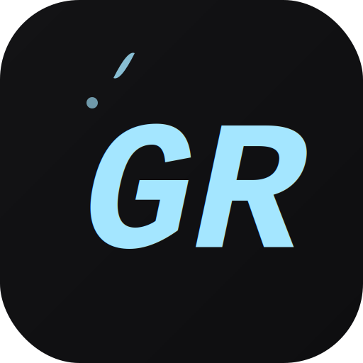
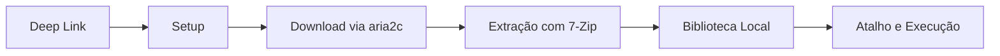

# <p align="center">🎮 Gaming Rumble</p>

<p align="center">
  
</p>

<p align="center">
  Cliente desktop construído com Tauri para consumir payloads compatíveis, baixar jogos via magnet link, extrair automaticamente e organizar a biblioteca local no Windows.
</p>

<p align="center">
  
  
  
  
  
</p>

---

## 📌 Sobre

O Gaming Rumble é o client desktop do ecossistema. Ele recebe um payload via protocolo `gaming-rumble://`, prepara o ambiente, executa o download do torrent, extrai os arquivos e registra o jogo na biblioteca local.

O foco do app é reduzir atrito: menos passos manuais, menos setup repetitivo e uma experiência mais direta para instalação e gerenciamento.

## ⚠️ Compatibilidade

> [!WARNING]
> Este client foi pensado para trabalhar com payloads e magnet links compatíveis com o fluxo do ecossistema Gaming Rumble.
>
> Na prática, a origem suportada hoje é o conteúdo vindo do index baseado em `online-fix.me`.
>
> Magnet links aleatórios de outras fontes podem falhar, não seguir o layout esperado ou gerar comportamento imprevisível. Não há garantia de compatibilidade fora desse fluxo.

## 🧭 Fluxo Do Produto



## ✨ Recursos Principais

- Download via BitTorrent com acompanhamento em tempo real
- Suporte a protocolo `gaming-rumble://`
- Extração automática com fluxo pós-instalação
- Modo `Fix Only` para baixar apenas o fix quando necessário
- Detecção do executável principal do jogo
- Criação automática de atalho no Menu Iniciar
- Biblioteca persistente com ações de abrir, jogar e remover
- Pausa e retomada de download
- Verificação de espaço em disco antes da instalação
- Tratamento separado para erros de download e erros de extração

## 🧱 Stack Atual

### Base do projeto

<table align="center">
  <tr>
    <td align="center">
      <br>
      <strong>React 19</strong>
    </td>
    <td align="center">
      <br>
      <strong>TypeScript</strong>
    </td>
    <td align="center">
      <br>
      <strong>Tauri 2</strong>
    </td>
    <td align="center">
      <br>
      <strong>Tailwind 4</strong>
    </td>
    <td align="center">
      <br>
      <strong>Rust</strong>
    </td>
  </tr>
</table>

## 🖥️ Plataforma Suportada

| Sistema | Status |
|---|---|
| Windows 10 | Suportado |
| Windows 11 | Suportado |
| Linux | Não suportado oficialmente |
| macOS | Não suportado oficialmente |

O projeto atual foi estruturado e empacotado com foco em Windows.

## 🔗 Protocolo `gaming-rumble://`

O app registra o protocolo `gaming-rumble://` no sistema operacional. Quando esse link é aberto, o payload em Base64 é decodificado pelo client.

Exemplo de payload:

```json
{
  "title": "Nome do Jogo",
  "banner": "https://shared.akamai.steamstatic.com/.../header.jpg",
  "parts": 4,
  "fileSize": "551.10 MB",
  "magnet": "magnet:?xt=urn:btih:..."
}
```

### Resumo do comportamento

- O navegador, Discord ou outro app dispara o protocolo
- O Tauri recebe a URI
- O payload é decodificado
- O usuário confirma a instalação
- O download e a extração seguem dentro do app

## 📦 Binários Externos

| Binário | Status | Finalidade |
|---|---|---|
| `aria2c.exe` | Bundled | Download BitTorrent |
| `7-ZIP/` | Bundled | Extração de arquivos e suporte RAR/RAR5 |

## 🛠️ Pré-requisitos

| Ferramenta | Necessária | Observação |
|---|---|---|
| Node.js LTS | Sim | Para frontend e comandos do Tauri |
| Rust / rustup | Sim | Toolchain nativa do app |
| Windows 10/11 | Sim | Plataforma suportada hoje |

## 🚀 Desenvolvimento

### Instalar dependências

```bash
npm install
```

### Rodar em desenvolvimento

```bash
npm run tauri dev
```

### Gerar build local

```bash
npm run tauri build
```

## 🗂️ Estrutura Do Projeto

```txt
Gaming Rumble/
├── src/
│   ├── App.tsx
│   ├── payload.ts
│   ├── types.ts
│   └── components/
│       ├── Layout/
│       └── Views/
├── src-tauri/
│   ├── src/
│   │   └── commands/
│   └── tauri.conf.json
├── public/
├── .github/workflows/
└── README.md
```

### Visão rápida por pasta

| Caminho | Conteúdo |
|---|---|
| `src/` | App React, views, tipos e utilitários do payload |
| `src/components/Views/` | Telas de setup, atividade, biblioteca e configurações |
| `src-tauri/src/commands/` | Comandos nativos em Rust |
| `src-tauri/tauri.conf.json` | Configuração principal do Tauri |
| `.github/workflows/build.yml` | Build e release da `main` |

## 🧪 Build E Release

### Build local

```bash
npm run tauri build
```

Os binários são gerados em:

- `src-tauri/target/release/bundle/msi/`
- `src-tauri/target/release/bundle/nsis/`

### CI na `main`

O workflow de build da branch `main`:

- instala Node.js
- instala Rust stable
- instala WebView2
- gera o build Tauri
- publica artefatos
- cria tag quando necessário
- cria release no GitHub

Esse workflow dispara apenas em alterações na `main`.

## 📝 Observações Técnicas

- O app usa janela desktop fixa e sem decorações nativas
- O estado do download é persistido localmente para sobreviver a reload em desenvolvimento
- O fluxo usa eventos do Tauri para acompanhar logs e progresso
- A biblioteca é mantida localmente pelo client
- O app foi desenhado para consumo do ecossistema Gaming Rumble, não como cliente torrent genérico

## ⚖️ Aviso Legal

> [!WARNING]
> Este software é fornecido **"AS IS"**, sem garantias de qualquer tipo.
>
> - Este client não possui, não hospeda, não distribui e não facilita acesso direto a conteúdo protegido por direitos autorais.
> - O app apenas automatiza o processo técnico de consumo de payload, download e extração.
> - Não há suporte para problemas relacionados ao conteúdo acessado pelo usuário.
> - O uso é por conta e risco de quem estiver executando o software.
> - Ao usar este client, você assume total responsabilidade pelo conteúdo que acessar e instalar.

---

<p align="center"><strong>Gaming Rumble Engine © 2026 — Todos os direitos reservados.</strong></p>
