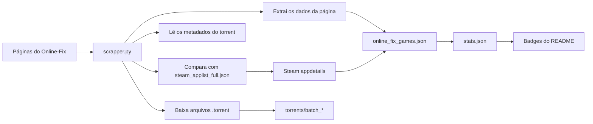
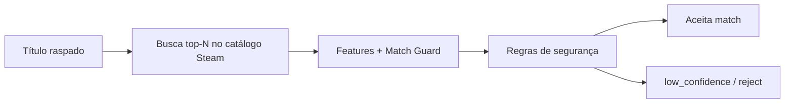

# 🎮 Gaming Rumble (Scrapper)

> Pipeline automatizado para indexar jogos do Online-Fix, salvar arquivos `.torrent` neste repositório, enriquecer correspondências confiáveis com metadados da Steam e publicar um dataset pronto para consumo por apps, APIs, badges e dashboards.

## ✨ Snapshot Ao Vivo

| Total de Jogos | Steam Encontrados | Steam Ausentes | Success Rate | Páginas Online-Fix | Arquivos Torrent | Último Update |
|:---:|:---:|:---:|:---:|:---:|:---:|:---:|
|  |  |  |  |  |  |  |

## 📌 O Que Este Repositório Faz

Este projeto automatiza toda a pipeline de coleta dos jogos do Online-Fix:

- Faz scrape das páginas em `online-fix.me`
- Baixa e armazena arquivos `.torrent` dentro do repositório
- Extrai metadados do torrent como BTIH, lista de arquivos e magnet link
- Tenta encontrar o jogo no catálogo local da Steam
- Busca `appdetails` da Steam apenas para matches confiáveis
- Publica `online_fix_games.json` como dataset principal
- Publica `stats.json` para badges, automações e consumo externo

## 🌍 Aviso Público Do Dataset

> [!IMPORTANT]
> Este repositório é público, e o dataset gerado também é público.
>
> **Dataset principal**
> `online_fix_games.json`
>
> **URL raw direta**
> [https://raw.githubusercontent.com/zKauaFerreira/The-Gaming-Rumble/refs/heads/games/online_fix_games.json](https://raw.githubusercontent.com/zKauaFerreira/The-Gaming-Rumble/refs/heads/games/online_fix_games.json)
>
> **Snapshot do catálogo Steam**
> [https://raw.githubusercontent.com/zKauaFerreira/The-Gaming-Rumble/refs/heads/games/steam_applist_full.json](https://raw.githubusercontent.com/zKauaFerreira/The-Gaming-Rumble/refs/heads/games/steam_applist_full.json)
>
> **Agenda de atualização**
> O dataset é atualizado automaticamente todos os dias via GitHub Actions, atualmente por volta de **18:00 UTC**.
>
> **Uso recomendado**
> Para evitar várias requisições repetidas ao raw do GitHub e reduzir a chance de rate limit, o ideal é baixar o JSON primeiro e consumi-lo localmente por arquivo, cache ou banco de dados.

### ⬇️ Recomendado: Baixe O JSON Localmente Primeiro

Usando `curl`:

```bash
curl -L "https://raw.githubusercontent.com/zKauaFerreira/The-Gaming-Rumble/refs/heads/games/online_fix_games.json" -o online_fix_games.json
```

Usando `wget`:

```bash
wget -O online_fix_games.json "https://raw.githubusercontent.com/zKauaFerreira/The-Gaming-Rumble/refs/heads/games/online_fix_games.json"
```

Depois disso, carregue o arquivo local no seu script, app, API ou rotina de banco, em vez de bater na URL raw a cada requisição.

## 🧠 Saídas Principais

| Arquivo | Finalidade |
|---|---|
| `online_fix_games.json` | Dataset principal indexado |
| `stats.json` | Estatísticas leves para badges, dashboards e automações |
| `steam_applist_full.json` | Catálogo local da Steam usado para matching offline |
| `low_confidence_matches.json` | Log circular dos casos rejeitados por baixa confiança para revisão e re-treino |
| `torrents/batch_*/*.torrent` | Arquivos torrent salvos e agrupados por página |

## 🗂️ Estrutura Do Dataset

### `online_fix_games.json`

Estrutura de topo:

```json
{
  "total": 1679,
  "downloads": []
}
```

Cada item de `downloads` contém os dados raspados do jogo, os metadados do torrent e, quando houver match confiável, os metadados da Steam.

### Campos de update vindos da página

O scraper lê o bloco de atualização presente na seção `edit` da página do Online-Fix, por exemplo:

```txt
Обновлено: Вчера, 13:24. Причина: Игра обновлена до версии 1.11.8838be4.
```

Esses dados são distribuídos nos campos abaixo:

- `update_info`: texto bruto de atualização/mudança extraído da página
- `update_date`: data normalizada e estruturada quando o scraper consegue interpretar o valor
- `formatted_update_date`: versão legível e normalizada da data de update
- `last_update`: valor de `<time datetime="...">` quando esse campo existe no HTML

### Campos de cada entrada

| Campo | Descrição |
|---|---|
| `title` | Título limpo do jogo |
| `url` | URL da página no Online-Fix |
| `page` | Número da página de origem |
| `last_update` | Valor do `<time datetime="...">` extraído do HTML |
| `release_date` | Data de lançamento capturada no preview da página |
| `update_info` | Texto bruto do bloco `edit` com a informação da mudança |
| `update_date` | Data estruturada derivada do bloco de update |
| `formatted_update_date` | Data de update normalizada em formato amigável |
| `unique_hash` | Info-hash / BTIH do torrent |
| `fileSize` | Tamanho total do torrent |
| `magnet` | Magnet link com trackers |
| `torrent_file` | URL raw do GitHub apontando para o `.torrent` salvo |
| `created_at` | Data de criação do torrent |
| `webdav_updated_at` | Valor `last-modified` do WebDAV quando disponível |
| `files` | Lista de arquivos dentro do torrent com nomes e tamanhos |
| `comment` | Comentário embutido no torrent |
| `scraped_at` | Timestamp local em que a entrada foi processada |
| `steam` | Objeto com metadados da Steam ou payload `not_found` com motivo |

<details>
<summary><strong>Exemplo de entrada</strong></summary>

```json
{
  "title": "10 Miles to Safety",
  "page": 72,
  "url": "https://online-fix.me/games/survival/123-example.html",
  "last_update": "2026-04-23T13:24:00+03:00",
  "release_date": "19.10.2020",
  "update_info": "Обновлено: Вчера, 13:24. Причина: Игра обновлена до версии 1.11.8838be4.",
  "update_date": "2026-04-23T13:24:00+03:00",
  "formatted_update_date": "2026-04-23 13:24:00",
  "unique_hash": "0123456789abcdef0123456789abcdef01234567",
  "fileSize": "2.34 GB",
  "magnet": "magnet:?xt=urn:btih:0123456789abcdef0123456789abcdef01234567",
  "torrent_file": "https://raw.githubusercontent.com/zKauaFerreira/The-Gaming-Rumble/games/torrents/batch_72/10.Miles.to.Safety.v1.0-OFME.torrent",
  "created_at": "2026-04-23 13:27:15",
  "webdav_updated_at": "Thu, 23 Apr 2026 10:27:15 GMT",
  "files": [
    {
      "name": "10 Miles to Safety/10 Miles to Safety.exe",
      "size": "1.85 GB"
    }
  ],
  "comment": "Example torrent comment",
  "scraped_at": "2026-04-23 18:55:10",
  "steam": {
    "steam_appid": 1015140,
    "match_score": 92,
    "header_image": "https://shared.akamai.steamstatic.com/store_item_assets/steam/apps/1015140/header.jpg",
    "short_description": "O Apocalipse chegou e seu objetivo é simples...",
    "short_description_native": "The apocalypse is here and your goal is simple...",
    "price_brl": "R$ 20,69",
    "is_free": false,
    "pc_requirements": {
      "minimum": "OS: Windows 7...",
      "recommended": null
    },
    "controller_support": "full"
  }
}
```

</details>

<details>
<summary><strong>Exemplo do objeto Steam</strong></summary>

Quando existe um match confiável com a Steam, o campo `steam` fica assim:

```json
{
  "steam_appid": 1015140,
  "match_score": 92,
  "header_image": "https://shared.akamai.steamstatic.com/store_item_assets/steam/apps/1015140/header.jpg",
  "short_description": "O Apocalipse chegou e seu objetivo é simples...",
  "short_description_native": "The apocalypse is here and your goal is simple...",
  "price_brl": "R$ 20,69",
  "is_free": false,
  "pc_requirements": {
    "minimum": "OS: Windows 7...",
    "recommended": null
  },
  "controller_support": "full"
}
```

Se o scraper não conseguir validar um match seguro, ele grava um fallback leve assim:

```json
{
  "not_found": true,
  "reason": "low_confidence",
  "search_url": "https://store.steampowered.com/api/storesearch/?term=example&l=portuguese&cc=BR"
}
```

</details>

### `stats.json`

Este arquivo foi pensado para ser amigável com badges.

<details>
<summary><strong>Exemplo de estrutura</strong></summary>

```json
{
  "repo": "zKauaFerreira/The-Gaming-Rumble",
  "branch": "games",
  "raw_base_url": "https://raw.githubusercontent.com/zKauaFerreira/The-Gaming-Rumble/games/torrents/",
  "total_games": 1679,
  "online_fix_total": 1679,
  "steam_with_metadata": 243,
  "steam_without_metadata": 1436,
  "match_rate": 14.47,
  "success_rate": 85.53,
  "online_fix_pages_total": 53,
  "pages_scraped_target": 53,
  "pages_present_in_json": 53,
  "last_page_in_json": 53,
  "new_games_found_this_run": 21,
  "processed_games_this_run": 20,
  "torrent_files_total": 1679,
  "json_entries_with_torrent": 1679,
  "last_scrape_at": "2026-04-23 17:32:10",
  "last_game_update": "2026-04-23 16:58:00",
  "generated_at": "2026-04-23 17:32:10"
}
```

</details>

## 🏗️ Como A Pipeline Funciona



## 🔎 Notas Sobre O Fuzzy Matching

O matcher da Steam é propositalmente conservador.

- Normaliza pontuação, acentos e números romanos comuns
- Compara tokens relevantes em vez de confiar em palavras genéricas
- Trata números e anos separadamente para reduzir falso positivo
- Rejeita candidatos de baixa confiança em vez de forçar um match errado

Isso significa que um jogo pode aparecer com `steam.not_found = true` quando a confiança é baixa, e isso costuma ser melhor do que anexar metadados do jogo errado.

## 🤖 Match Guard Leve

Além do fuzzy principal, o projeto agora usa uma camada leve de classificação para repescagem e validação final dos matches da Steam.

### Componentes

| Item | Arquivo | Função |
|---|---|---|
| Modelo leve | `tools/match_guard_model.json` | Pesos do classificador serializados em JSON |
| Treino offline | `tools/train_match_guard.py` | Gera features, monta dataset e salva o modelo |
| Benchmark rápido | `tools/benchmark_match_guard.py` | Mede modelo puro, híbrido e lookup real |
| Suíte por catálogo | `tools/catalog_match_guard_suite.py` | Gera e testa casos difíceis diretamente do `steam_applist_full.json` |
| Aliases curados | `tools/match_guard_aliases.json` | Corrige casos históricos, renomeados ou subtitulados |
| Log contínuo | `low_confidence_matches.json` | Guarda rejeições de baixa confiança para revisão e re-treino |

### O que essa camada resolve

**Recupera matches bons com pequenas diferenças de nome**

| Query | Match correto |
|---|---|
| `Godfall` | `Godfall Ultimate Edition` |
| `Demeo PC Edition` | `Demeo` |
| `Hasbros BATTLESHIP` | `Hasbro's BATTLESHIP` |
| `Ghost of Tsushima DIRECTORS CUT` | `Ghost of Tsushima DIRECTOR'S CUT` |

**Bloqueia falsos positivos perigosos**

- Penaliza candidatos parecidos de franquia errada
- Evita matches “criativos demais” em títulos curtos ou muito genéricos
- Mantém aliases explícitos separados, sem enfraquecer a regra geral

**Protege franquias numeradas**

- `Forza Horizon 3` nunca deve casar com `Forza Horizon 4`
- `Forza Horizon 4` nunca deve casar com `Forza Horizon 5`
- `Resident Evil 2` nunca deve casar com `Resident Evil 3`
- `Halo Wars 2` nunca deve casar com `Halo Wars 3`

### Features usadas pelo modelinho

| Grupo | Features |
|---|---|
| Similaridade fuzzy | `token_set_ratio`, `token_sort_ratio`, `ratio`, `partial_ratio` |
| Igualdade textual | igualdade normalizada, igualdade compacta e contenção de string |
| Igualdade canônica | igualdade com e sem descritores, inclusive stripping de sufixos como `Ultimate Edition` e `PC Edition` |
| Similaridade por tokens | overlap e Jaccard de tokens gerais, relevantes e canônicos |
| Regras de sequência | conflito explícito de franquia/número, comparação de números romanos/arábicos e anos |
| Sinais estruturais | diferença de comprimento, contagem de tokens extras e interseção de tokens fortes |

### Estratégia de treino

- positivos reais extraídos do dataset atual
- positivos sintéticos gerados a partir do catálogo da Steam
- variações artificiais de sufixos e edições:
  - `Ultimate Edition`
  - `Definitive Edition`
  - `PC Edition`
  - `Digital Edition`
- hard negative mining com candidatos textualmente parecidos
- hard negatives de franquia, principalmente quando a série é igual mas o número muda
- casos automáticos gerados a partir do próprio catálogo da Steam, cobrindo:
  - apóstrofo
  - `&`
  - `:`
  - números romanos
  - anos
  - edições
  - nomes com parênteses
  - non-ASCII
  - títulos muito longos

### Como treinar e validar

```bash
python tools/train_match_guard.py
python tools/benchmark_match_guard.py
python tools/catalog_match_guard_suite.py
```

O benchmark separa três níveis:

- `PURE_MODEL_ACCURACY`
- `HYBRID_MODEL_ACCURACY`
- `LOOKUP_ACCURACY`

### Fluxo de decisão



As regras de segurança continuam mandando no resultado final:

- conflito de franquia e número rejeita o candidato
- match canônico forte pode validar mesmo quando o fuzzy tem ruído
- casos históricos podem ser resolvidos por alias explícito
- rejeições importantes vão para `low_confidence_matches.json`

### Métricas locais atuais

| Métrica | Resultado |
|---|---|
| Holdout do treino | `99%+` |
| Benchmark do modelo puro | `24/24` |
| Benchmark do pipeline híbrido | `24/24` |
| Benchmark de lookup real | `24/24` |
| Bateria funcional ampliada | `50/50` |
| Suíte automática do catálogo Steam | `223/237` positivos e `160/160` negativos |

> [!NOTE]
> O alvo real do projeto não é “IA pura”, e sim **matching confiável em runner**. O resultado forte vem da combinação entre fuzzy, classificador leve, aliases curados e guard rails de franquia/número.

### O que a suíte do catálogo mede

A suíte baseada no `steam_applist_full.json` gera casos sintéticos a partir de jogos reais da Steam para forçar o matcher em cenários difíceis:

- remover apóstrofos
- trocar `&` por `and`
- colapsar pontuação
- remover sufixos de edição
- testar nomes com romanos, anos, non-ASCII e títulos longos
- validar colisões entre jogos da mesma franquia com número diferente

Os números mais importantes dessa suíte são:

| Grupo | Resultado |
|---|---|
| Positivos por catálogo | `223/237` |
| Negativos por conflito de franquia/número | `160/160` |

Os positivos que ainda falham não costumam ser “erro bruto” do modelo. Em geral são casos em que a transformação deixa o nome ambíguo demais, por exemplo:

- título delistado ou legado que só existe na Steam com um subtítulo/classificador específico
- nome base genérico demais depois de remover `(...)`
- casos em que cortar tudo antes/depois de `:` deixa o jogo com poucas palavras úteis

Isso é útil porque mostra exatamente onde vale investir em:

- alias explícito
- regras específicas de legado/collection/classic
- revisão manual via `low_confidence_matches.json`

## 📋 Novo Formato De Log

O processamento da fase 2 agora prioriza uma linha compacta por jogo, reduzindo o ruído de mensagens intermediárias.

Exemplo:

```text
✅ [0012/1500] | Ghost of Tsushima         | T:OK S:OK |  450ms | P:005 | 🌐 | M:   0MB | OK                 | 00:57:22
❌ [0013/1500] | Forza Horizon 4           | T:OK S:!! | 2100ms | P:005 | 🌐 | M:   0MB | low_confidence     | 00:57:22
```

### Campos da linha

| Campo | Significado |
|---|---|
| status final | `✅`, `⚠️` ou `❌` |
| `[atual/total]` | progresso do processamento |
| nome | título truncado para leitura rápida |
| `T:OK / T:!!` | status do torrent |
| `S:OK / S:!!` | status do match Steam |
| `ms` | latência total por jogo |
| `P:NNN` | página de origem no Online-Fix |
| `🌐 / 🏠` | proxy ativo ou conexão local |
| `M:NNNMB` | memória do processo quando disponível |
| motivo final | resumo do resultado ou da falha |
| horário | timestamp local da linha |

### Motivos finais mais comuns

| Motivo | Significado |
|---|---|
| `OK` | torrent e Steam resolvidos com sucesso |
| `low_confidence` | candidato Steam rejeitado por confiança insuficiente |
| `keyword_missing` | palavra-chave obrigatória da franquia não apareceu no candidato |
| `NO_TORRENT_LINK` | página existe, mas o link de torrent não foi encontrado |
| `401` / `404` / `429` | código HTTP relevante da tentativa |
| `Timeout`, `ConnectionError`, etc. | exceção capturada durante o processo |

### Objetivo do formato novo

- reduzir spam de logs intermediários
- concentrar tudo que importa em uma linha por jogo
- facilitar debug visual em terminal, runner e GitHub Actions
- deixar latência, rede e motivo do erro visíveis sem precisar abrir stacktrace

## ⚙️ Configuração Local

### Requisitos

```bash
pip install -r requirements.txt
```

Dependências atuais:

```txt
requests
beautifulsoup4
cloudscraper
bencode.py
rapidfuzz
python-dotenv
```

### Variáveis de ambiente

Crie um `.env` ou exporte estas variáveis:

```bash
ONLINEFIX_USER=seu_usuario
ONLINEFIX_PASS=sua_senha
PROXY_LIST_URL=https://example.com/proxies.txt
GITHUB_REPOSITORY=zKauaFerreira/The-Gaming-Rumble
GITHUB_BRANCH=games
```

`PROXY_LIST_URL` aceita:

- Uma única URL
- Várias URLs separadas por `;`
- Várias URLs separadas por quebra de linha

Exemplo com várias listas de proxy:

```bash
PROXY_LIST_URL=https://example.com/list-a.txt;https://example.com/list-b.txt;https://example.com/list-c.txt
```

Espera-se que cada lista de proxy tenha um proxy por linha no formato:

```txt
IP:PORT:USER:PASS
```

### Catálogo da Steam

Para manter o matching rápido e majoritariamente offline, baixe o catálogo de apps da Steam:

```bash
curl "https://api.steampowered.com/ISteamApps/GetAppList/v2/" -o steam_applist_full.json
```

## 🚀 Uso

### Rodar o scraper

```bash
python scrapper.py --pages 10 --workers 8
```

### Argumentos CLI disponíveis

| Argumento | Descrição |
|---|---|
| `--pages` | Última página a ser processada |
| `--start-page` | Primeira página a ser processada |
| `--workers` | Concorrência para tarefas de torrent + Steam |
| `--baseurl` | Sobrescreve a URL base do Online-Fix |
| `--user` | Sobrescreve o usuário |
| `--password` | Sobrescreve a senha |
| `--cookie` | Cookie manual `online_fix_auth` |

## 🤖 GitHub Actions

Este repositório inclui três workflows:

| Workflow | Finalidade |
|---|---|
| `scrape.yml` | Executa o scraper e atualiza JSON + torrents + stats |
| `steam-applist.yml` | Atualiza o catálogo da Steam |
| `clean.yml` | Remove dados gerados da branch |

### Secrets necessários

- `ONLINEFIX_USER`
- `ONLINEFIX_PASS`
- `PROXY_LIST_URL` opcional, aceita uma ou várias URLs de lista de proxy
- `STEAM_API_KEY` apenas para `steam_applist.py`

## 🏷️ Badges Dinâmicas Com `stats.json`

Você pode criar uma badge para cada campo usando o Shields.io.

Exemplo:

```md

```

O parâmetro `url=` deve ser URL-encoded ao montar badges dinâmicas com JSON no Shields.

Consultas úteis:

| Rótulo | Query |
|---|---|
| Total Games | `%24.total_games` |
| Steam Matched | `%24.steam_with_metadata` |
| Steam Missing | `%24.steam_without_metadata` |
| Success Rate | `%24.success_rate` |
| Online-Fix Pages | `%24.online_fix_pages_total` |
| Torrent Files | `%24.torrent_files_total` |
| Last Update | `%24.last_scrape_at_display` |
| JSON Torrents | `%24.json_entries_with_torrent` |
| Last Page | `%24.last_page_in_json` |

> [!NOTE]
> O Shields.io usa cache, então as badges nem sempre atualizam imediatamente.

## 📁 Estrutura Do Repositório

```txt
.
├── .github/
│   └── workflows/
├── torrents/
│   └── batch_*/
├── online_fix_games.json
├── stats.json
├── scrapper.py
├── steam_applist.py
├── steam_applist_full.json
├── requirements.txt
└── README.md
```

## 🛠️ Notas Operacionais

- O site alvo retorna conteúdo não UTF-8 em algumas respostas
- O bypass do Cloudflare usa `cloudscraper` quando disponível
- Os metadados da Steam só são buscados após o match no catálogo local
- Rotação de proxies ajuda a reduzir rate limit nas chamadas da Steam
- Os links raw de torrent são normalizados para este repositório e para a branch `games`

## ⚠️ Importante

> [!WARNING]
> Não faça commit de credenciais reais, cookies ou listas privadas de proxy neste repositório.

> [!TIP]
> Se o HTML do site mudar, comece revisando `_extract_games`, `find_torrent_robust` e os helpers de Steam matching dentro de `scrapper.py`.

## 📜 Licença

Este repositório é disponibilizado apenas para fins educacionais e de pesquisa.

Veja a licença completa e o aviso legal em [LICENSE](C:/Users/Administrator/Pictures/Gaming-Rumble/LICENSE).

### Resumo do aviso

> [!WARNING]
> Este software é fornecido **"AS IS"**, sem garantia de qualquer tipo, expressa ou implícita, incluindo, mas não se limitando, a comercialização, adequação a um propósito específico e não violação.
>
> Os autores não se responsabilizam por mau uso, violações de direitos autorais ou quaisquer danos diretos, indiretos, incidentais ou consequentes decorrentes do uso deste projeto.
>
> Ao usar este repositório, você assume total responsabilidade por qualquer conteúdo que acessar, processar ou instalar.
