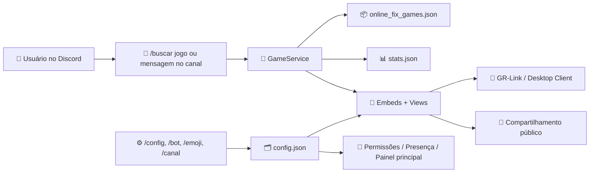

# 🤖 Gaming Rumble (Discord Bot)

<p align="center">
  
</p>

<br>

> Bot Discord em Python para consulta do catálogo do Gaming Rumble, com busca fuzzy em tempo real, embeds interativas, canal dedicado de descoberta, painel administrativo e integração automática com os datasets públicos do projeto.

## ✨ Snapshot Do Projeto

| Linguagem | Framework | Dataset | UI | Runtime |
|:---:|:---:|:---:|:---:|:---:|
|  |  |  |  |  |

---

## 📋 Índice

<details open>
<summary><b>Clique para expandir/recolher</b></summary>

- 📖 [Sobre o Projeto](#-sobre-o-projeto)
- ✨ [Funcionalidades](#-funcionalidades)
- 🧱 [Arquitetura](#-arquitetura)
- 🤖 [Fluxo Principal No Discord](#-fluxo-principal-no-discord)
- 📡 [Datasets Consumidos](#-datasets-consumidos)
- ⚙️ [Configuração Via Comandos](#️-configuração-via-comandos)
- 🚀 [Pré-requisitos](#-pré-requisitos)
- 📦 [Instalação](#-instalação)
- 💻 [Executando O Projeto](#-executando-o-projeto)
- 🔄 [Sincronização Do Catálogo](#-sincronização-do-catálogo)
- 🧩 [Mensagens Rotativas De Atividade](#-mensagens-rotativas-de-atividade)
- 🗂️ [Estrutura Do Projeto](#️-estrutura-do-projeto)
- 🛠️ [Notas Operacionais](#️-notas-operacionais)
- 🤝 [Contribuindo](#-contribuindo)
- 📄 [Licença](#-licença)

</details>

---

## 📖 Sobre o Projeto

O Discord Bot do Gaming Rumble foi criado para transformar o dataset do projeto em uma experiência interativa dentro do Discord.

Ele atua como camada de consulta, descoberta e compartilhamento entre:

- catálogo público do scraper
- servidor Discord
- embeds de jogo
- GR-Link / Desktop Client

O objetivo do bot é reduzir atrito no fluxo de descoberta de jogos.

Em vez de navegar manualmente pelo dataset, o usuário pode:

- digitar o nome do jogo no canal configurado
- usar `/buscar jogo` com autocomplete
- receber embeds efêmeras com botões de ação
- compartilhar resultados publicamente com expiração automática

---

## ✨ Funcionalidades

| Feature | Descrição |
|---|---|
| Busca Fuzzy | Pesquisa jogos por slash command ou mensagem normal |
| Autocomplete | `/buscar jogo` sugere resultados em tempo real |
| Canal Dedicado | O bot pode operar em um canal configurado exclusivamente para busca |
| Confirmação Inteligente | Match exato mostra confirmação; match ambíguo mostra seleção |
| Embeds Interativas | Cards com banner, descrição, tamanho, atualização e controle |
| Requisitos On Demand | Botão que abre requisitos mínimos e recomendados |
| Compartilhamento Público | Compartilha o jogo em outro canal com expiração configurável |
| Catálogo Paginado | Navegação por páginas via botão no painel principal |
| Emoji Configurável | Emojis de botões e avisos configuráveis por painel |
| Permissões por Cargo | Controle fino para admin, busca e compartilhamento |
| Sync De Dataset | Atualiza `online_fix_games.json` e `stats.json` via script separado |
| Auto Refresh | Painel principal é re-renderizado quando o dataset muda |
| Presença Rotativa | Status do bot com placeholders dinâmicos |

---

## 🧱 Arquitetura



---

## 🤖 Fluxo Principal No Discord

### Busca por slash command

```txt
1. Usuário abre /buscar jogo
2. O autocomplete sugere resultados do catálogo
3. O usuário escolhe um item
4. O bot responde com embed efêmera do jogo
5. A embed pode abrir requisitos ou compartilhar o jogo
```

### Busca por mensagem no canal do bot

```txt
1. Usuário digita o nome do jogo no canal configurado
2. A mensagem é apagada pelo bot
3. O bot faz o fuzzy matching
4. Se houver match exato:
   → mostra confirmação pública com expiração

5. Se houver ambiguidade:
   → mostra select com até 5 opções

6. Ao confirmar ou selecionar:
   → o bot envia a embed final em mensagem efêmera
```

---

## 📡 Datasets Consumidos

O bot usa os mesmos arquivos públicos gerados pelo ecossistema Gaming Rumble:

| Arquivo | Função |
|---|---|
| `online_fix_games.json` | Fonte principal de jogos, magnet, arquivos e metadados Steam |
| `stats.json` | Estatísticas do catálogo para painel principal e placeholders |
| `config.json` | Configuração persistente do bot por servidor |
| `requirements_translations.json` | Traduções e normalizações dos requisitos de sistema |

### URLs padrão usadas no sync

| Tipo | URL |
|---|---|
| Dataset principal | `https://raw.githubusercontent.com/zKauaFerreira/The-Gaming-Rumble/refs/heads/games/online_fix_games.json` |
| Estatísticas | `https://raw.githubusercontent.com/zKauaFerreira/The-Gaming-Rumble/refs/heads/games/stats.json` |

---

## ⚙️ Configuração Via Comandos

### Comandos principais

| Comando | Descrição |
|---|---|
| `/buscar jogo` | Busca direta com autocomplete |
| `/canal criar` | Cria o canal oficial do bot |
| `/canal setar` | Define um canal existente como canal do bot |
| `/canal ver` | Mostra o canal configurado |
| `/canal atualizar` | Atualiza a mensagem principal do painel |
| `/config adm` | Gerencia cargos com acesso administrativo |
| `/config buscar` | Gerencia cargos autorizados a buscar jogos |
| `/config messages` | Configura mensagens rotativas de atividade |
| `/bot config` | Painel geral de timeout, cargos e comportamento |
| `/emoji adicionar` | Adiciona emoji ao servidor por URL ou arquivo |
| `/emoji config` | Configura emojis usados pelo bot |
| `/clear` | Limpa o canal do bot preservando o painel principal |
| `/ping` | Verifica latência do bot |

### O que o `/bot config` controla

- tempo de expiração das mensagens públicas de confirmação/seleção
- cargo marcado acima da embed principal
- cargo permitido para compartilhar jogos
- cargo mencionado em mensagens compartilhadas

---

## 🚀 Pré-requisitos

| Dependência | Necessária |
|---|---|
| Python 3.11+ | Sim |
| `pip` | Sim |
| Token de bot do Discord | Sim |
| Dataset local atualizado | Sim |

Dependências atuais:

```txt
discord.py>=2.5.0,<3.0.0
```

---

## 📦 Instalação

### Clone o projeto

```bash
git clone <url-do-repositorio>
```

### Entre na pasta

```bash
cd "Rumble BOT"
```

### Instale as dependências

```bash
pip install -r requirements.txt
```

### Configure o ambiente

Copie `.env.example` para `.env` e preencha os campos necessários:

```env
DISCORD_TOKEN=
DISCORD_GUILD_ID=
LOG_LEVEL=INFO
DATA_FILE=online_fix_games.json
CONFIG_FILE=config.json
DEV_AUTORELOAD=true
DEV_RELOAD_INTERVAL=1.0
SYNC_GLOBAL_COMMANDS=false
JSON_GAMES=https://raw.githubusercontent.com/zKauaFerreira/The-Gaming-Rumble/refs/heads/games/online_fix_games.json
JSON_STATS=https://raw.githubusercontent.com/zKauaFerreira/The-Gaming-Rumble/refs/heads/games/stats.json
```

---

## 💻 Executando O Projeto

### Desenvolvimento

```bash
python main.py
```

O supervisor de desenvolvimento:

- reinicia o bot quando arquivos Python mudam
- ignora `online_fix_games.json` e `stats.json` para não reiniciar o processo por sync de dataset
- limpa o console quando existir terminal interativo
- mostra quais arquivos dispararam o restart

### Produção

Para produção em Ubuntu/Linux, o recomendado é:

```env
DEV_AUTORELOAD=false
```

e então:

```bash
python main.py
```

---

## 🔄 Sincronização Do Catálogo

O projeto inclui um script auxiliar para atualizar os datasets e finalizar em seguida, ideal para cron:

```bash
python sync_catalog.py
```

O script:

- lê `JSON_GAMES` e `JSON_STATS` do `.env`
- baixa os dois arquivos
- substitui os arquivos locais
- encerra completamente

### Exemplo de cron no Ubuntu

```bash
*/30 * * * * cd /caminho/do/bot && /usr/bin/python3 sync_catalog.py
```

Quando `online_fix_games.json` ou `stats.json` mudam:

- o bot recarrega o cache
- atualiza automaticamente a mensagem principal do canal configurado

---

## 🧩 Mensagens Rotativas De Atividade

O bot suporta mensagens de presença configuráveis por `/config messages`.

Formato:

```txt
🎮 {{total_games}} jogos disponíveis [20s]
🆕 Último jogo: {{latest_game}} [11s]
⚡ Latência: {{latency_ms}}ms [10s]
```

### Placeholders disponíveis

| Placeholder | Descrição |
|---|---|
| `{{total_games}}` | Total de jogos no dataset |
| `{{new_games_count}}` | Quantidade de jogos novos na última execução |
| `{{latest_game}}` | Último jogo listado em `latest_run_new_game_names` |
| `{{latest_update}}` | Última atualização formatada do dataset |
| `{{servers}}` | Número de servidores conectados |
| `{{users}}` | Soma de membros dos servidores conectados |
| `{{latency_ms}}` | Latência atual do bot em ms |

Regras:

- se houver apenas uma mensagem, ela fica fixa
- se houver duas ou mais, todas precisam ter duração
- se enviar vazio, o bot limpa a configuração

---

## 🗂️ Estrutura Do Projeto

```txt
Rumble BOT/
├── app/
│   ├── bot.py
│   ├── config.py
│   └── logging_config.py
├── cogs/
│   ├── admin.py
│   ├── bot_config.py
│   ├── config.py
│   ├── emoji.py
│   ├── games.py
│   ├── listener.py
│   └── system.py
├── domain/
├── repositories/
├── services/
├── utils/
├── tests/
├── config.json
├── online_fix_games.json
├── stats.json
├── requirements_translations.json
├── sync_catalog.py
├── main.py
└── README.md
```

### Visão rápida das pastas

| Caminho | Finalidade |
|---|---|
| `app/` | Bootstrap, config, logging e ciclo principal do bot |
| `cogs/` | Comandos, listeners e painéis interativos |
| `repositories/` | Leitura e persistência de arquivos JSON |
| `services/` | Regras de negócio, busca e permissões |
| `utils/` | Embeds, views, encoder do GR-Link e helpers |
| `domain/` | Modelos tipados do catálogo |
| `tests/` | Testes auxiliares do projeto |

---

## 🛠️ Notas Operacionais

- O bot foi preparado para rodar tanto em Windows quanto em Linux
- O dataset principal é local e pode ser atualizado por cron sem reiniciar o bot
- O painel principal do canal é autoatualizável
- O canal configurado pode ser limpo automaticamente no startup
- O sistema de permissões separa administração, busca e compartilhamento
- As embeds finais suportam GR-Link, requisitos, compartilhamento e catálogo paginado
- O projeto foi desenhado para o ecossistema Gaming Rumble, não como bot genérico de torrent

---

## 🤝 Contribuindo

Fluxo recomendado:

```txt
Fork
 → Feature Branch
 → Commit
 → Pull Request
```

---

## 📄 Licença

Este projeto é disponibilizado apenas para fins educacionais e de pesquisa.

Veja a licença completa e o aviso legal em `LICENSE`.
