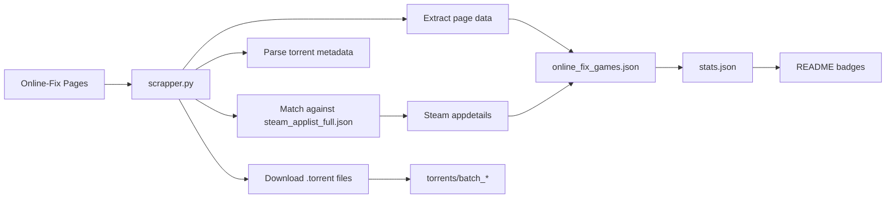

# 🎮 Gaming Rumble (Scrapper)

> An automated Online-Fix indexing pipeline that scrapes game entries, stores `.torrent` files in this repository, enriches confirmed matches with Steam metadata, and publishes a machine-readable dataset for badges, dashboards, and integrations.

## ✨ Live Snapshot

| Total Games | Steam Matched | Steam Missing | Success Rate | Online-Fix Pages | Torrent Files |
|:---:|:---:|:---:|:---:|:---:|:---:|
|  |  |  |  |  |  |

## 📌 What This Repository Does

This project automates the full data pipeline for Online-Fix game entries:

- Scrapes game pages from `online-fix.me`
- Downloads and stores `.torrent` files inside the repository
- Extracts torrent metadata such as BTIH, file list, and magnet link
- Tries to match each game against a local Steam app catalog
- Fetches Steam `appdetails` only for confident matches
- Publishes `online_fix_games.json` as the main dataset
- Publishes `stats.json` for dynamic badges and external consumers

## 🌍 Public Dataset Notice

> [!IMPORTANT]
> This repository is public, and the scraped dataset is public as well.
>
> **Main dataset**
> `online_fix_games.json`
>
> **Direct raw URL**
> [https://raw.githubusercontent.com/zKauaFerreira/The-Gaming-Rumble/refs/heads/games/online_fix_games.json](https://raw.githubusercontent.com/zKauaFerreira/The-Gaming-Rumble/refs/heads/games/online_fix_games.json)
>
> **Steam catalog snapshot**
> [https://github.com/zKauaFerreira/The-Gaming-Rumble/blob/games/steam_applist_full.json](https://github.com/zKauaFerreira/The-Gaming-Rumble/blob/games/steam_applist_full.json)
>
> **Update schedule**
> The dataset is refreshed automatically every day by GitHub Actions, currently around **18:00 UTC**.
>
> **Recommended usage**
> To reduce repeated raw GitHub requests and avoid unnecessary rate-limit pressure, download the JSON first and consume it locally from disk, cache, or your own database layer.

### ⬇️ Recommended: Download The JSON Locally First

Using `curl`:

```bash
curl -L "https://raw.githubusercontent.com/zKauaFerreira/The-Gaming-Rumble/refs/heads/games/online_fix_games.json" -o online_fix_games.json
```

Using `wget`:

```bash
wget -O online_fix_games.json "https://raw.githubusercontent.com/zKauaFerreira/The-Gaming-Rumble/refs/heads/games/online_fix_games.json"
```

Then load the local file from your own script, API, app, or database job instead of hitting the raw URL on every request.

## 🧠 Main Outputs

| File | Purpose |
|---|---|
| `online_fix_games.json` | Main indexed dataset |
| `stats.json` | Lightweight stats file for badges, dashboards, and automation |
| `steam_applist_full.json` | Local Steam catalog used for offline matching |
| `torrents/batch_*/*.torrent` | Stored torrent files grouped by source page |

## 🗂️ Dataset Structure

### `online_fix_games.json`

Top-level structure:

```json
{
  "total": 1679,
  "downloads": []
}
```

Each item in `downloads` contains the scraped game entry, torrent metadata, and optionally Steam metadata.

### Update fields from the page

The scraper reads the page update block from the `edit` section used by Online-Fix, for example:

```txt
Обновлено: Вчера, 13:24. Причина: Игра обновлена до версии 1.11.8838be4.
```

Those values are stored across these fields:

- `update_info`: the raw update/change text extracted from the page
- `update_date`: the parsed normalized update datetime when the scraper can structure it
- `formatted_update_date`: a human-friendly normalized datetime string
- `last_update`: the page `<time datetime="...">` value when present

### Entry fields

| Field | Description |
|---|---|
| `title` | Clean game title |
| `url` | Online-Fix game page |
| `page` | Source page number |
| `last_update` | `<time datetime="...">` value extracted from the page HTML |
| `release_date` | Release date parsed from page preview |
| `update_info` | Raw update/change text from the page `edit` block |
| `update_date` | Parsed structured date derived from the page update block |
| `formatted_update_date` | Human-friendly normalized update datetime |
| `unique_hash` | Torrent info-hash / BTIH source hash |
| `fileSize` | Total torrent size |
| `magnet` | Magnet link with trackers |
| `torrent_file` | Raw GitHub URL to the `.torrent` file |
| `created_at` | Torrent creation date |
| `webdav_updated_at` | WebDAV last-modified value when available |
| `files` | File list inside the torrent with file names and sizes |
| `comment` | Embedded torrent comment |
| `scraped_at` | Local scrape timestamp for this entry |
| `steam` | Steam metadata object, or a `not_found` payload with a reason |

### Example entry

```json
{
  "title": "10 Miles to Safety",
  "page": 72,
  "url": "https://online-fix.me/games/survival/123-example.html",
  "last_update": "2026-04-23T13:24:00+03:00",
  "release_date": "19.10.2020",
  "update_info": "Обновлено: Вчера, 13:24. Причина: Игра обновлена до версии 1.11.8838be4.",
  "update_date": "2026-04-23T13:24:00+03:00",
  "formatted_update_date": "2026-04-23 13:24:00",
  "unique_hash": "0123456789abcdef0123456789abcdef01234567",
  "fileSize": "2.34 GB",
  "magnet": "magnet:?xt=urn:btih:0123456789abcdef0123456789abcdef01234567",
  "torrent_file": "https://raw.githubusercontent.com/zKauaFerreira/The-Gaming-Rumble/games/torrents/batch_72/10.Miles.to.Safety.v1.0-OFME.torrent",
  "created_at": "2026-04-23 13:27:15",
  "webdav_updated_at": "Thu, 23 Apr 2026 10:27:15 GMT",
  "files": [
    {
      "name": "10 Miles to Safety/10 Miles to Safety.exe",
      "size": "1.85 GB"
    }
  ],
  "comment": "Example torrent comment",
  "scraped_at": "2026-04-23 18:55:10",
  "steam": {
    "steam_appid": 1015140,
    "match_score": 92,
    "header_image": "https://shared.akamai.steamstatic.com/store_item_assets/steam/apps/1015140/header.jpg",
    "short_description": "O Apocalipse chegou e seu objetivo é simples...",
    "short_description_native": "The apocalypse is here and your goal is simple...",
    "price_brl": "R$ 20,69",
    "is_free": false,
    "pc_requirements": {
      "minimum": "OS: Windows 7...",
      "recommended": null
    },
    "controller_support": "full"
  }
}
```

### Steam object example

When a confident Steam match exists, the `steam` field looks like this:

```json
{
  "steam_appid": 1015140,
  "match_score": 92,
  "header_image": "https://shared.akamai.steamstatic.com/store_item_assets/steam/apps/1015140/header.jpg",
  "short_description": "O Apocalipse chegou e seu objetivo é simples...",
  "short_description_native": "The apocalypse is here and your goal is simple...",
  "price_brl": "R$ 20,69",
  "is_free": false,
  "pc_requirements": {
    "minimum": "OS: Windows 7...",
    "recommended": null
  },
  "controller_support": "full"
}
```

If the scraper cannot validate a safe Steam match, it stores a lightweight fallback instead:

```json
{
  "not_found": true,
  "reason": "low_confidence",
  "search_url": "https://store.steampowered.com/api/storesearch/?term=example&l=portuguese&cc=BR"
}
```

### `stats.json`

This file is designed to be badge-friendly.

Example structure:

```json
{
  "repo": "zKauaFerreira/The-Gaming-Rumble",
  "branch": "games",
  "raw_base_url": "https://raw.githubusercontent.com/zKauaFerreira/The-Gaming-Rumble/games/torrents/",
  "total_games": 1679,
  "online_fix_total": 1679,
  "steam_with_metadata": 243,
  "steam_without_metadata": 1436,
  "match_rate": 14.47,
  "success_rate": 85.53,
  "online_fix_pages_total": 53,
  "pages_scraped_target": 53,
  "pages_present_in_json": 53,
  "last_page_in_json": 53,
  "new_games_found_this_run": 21,
  "processed_games_this_run": 20,
  "torrent_files_total": 1679,
  "json_entries_with_torrent": 1679,
  "last_scrape_at": "2026-04-23 17:32:10",
  "last_game_update": "2026-04-23 16:58:00",
  "generated_at": "2026-04-23 17:32:10"
}
```

## 🏗️ How The Pipeline Works



## 🔎 Fuzzy Matching Notes

The Steam matcher is intentionally conservative.

- It normalizes punctuation, accents, and common roman numerals
- It compares meaningful textual tokens instead of trusting generic words
- It handles numbers and years separately to reduce false positives
- It rejects low-confidence candidates instead of forcing a wrong Steam match

That means a game may appear with `steam.not_found = true` when confidence is too low, which is usually better than attaching metadata from the wrong title.

## ⚙️ Local Setup

### Requirements

```bash
pip install -r requirements.txt
```

Current dependencies:

```txt
requests
beautifulsoup4
cloudscraper
bencode.py
rapidfuzz
python-dotenv
```

### Environment Variables

Create a `.env` file or export these variables:

```bash
ONLINEFIX_USER=your_username
ONLINEFIX_PASS=your_password
PROXY_LIST_URL=https://example.com/proxies.txt
GITHUB_REPOSITORY=zKauaFerreira/The-Gaming-Rumble
GITHUB_BRANCH=games
```

`PROXY_LIST_URL` supports:

- A single URL
- Multiple list URLs separated by `;`
- Multiple list URLs separated by line breaks

Example with multiple proxy lists:

```bash
PROXY_LIST_URL=https://example.com/list-a.txt;https://example.com/list-b.txt;https://example.com/list-c.txt
```

Each proxy list is expected to contain one proxy per line in this format:

```txt
IP:PORT:USER:PASS
```

### Steam Catalog

To keep matching fast and mostly offline, download the Steam app catalog:

```bash
curl "https://api.steampowered.com/ISteamApps/GetAppList/v2/" -o steam_applist_full.json
```

## 🚀 Usage

### Run the scraper

```bash
python scrapper.py --pages 10 --workers 8
```

### Available CLI arguments

| Argument | Description |
|---|---|
| `--pages` | Final page to process |
| `--start-page` | First page to process |
| `--workers` | Concurrent workers for torrent + Steam tasks |
| `--baseurl` | Override Online-Fix base URL |
| `--user` | Username override |
| `--password` | Password override |
| `--cookie` | Manual `online_fix_auth` cookie |

## 🤖 GitHub Actions

This repository includes three workflows:

| Workflow | Purpose |
|---|---|
| `scrape.yml` | Runs the scraper and updates JSON + torrents + stats |
| `steam-applist.yml` | Refreshes the Steam app catalog |
| `clean.yml` | Removes generated data from the branch |

### Required secrets

- `ONLINEFIX_USER`
- `ONLINEFIX_PASS`
- `PROXY_LIST_URL` optional, supports one or many proxy-list URLs
- `STEAM_API_KEY` only for `steam_applist.py`

## 🏷️ Dynamic Badges From `stats.json`

You can create one badge per field with Shields.io.

Example:

```md

```

The `url=` parameter should be URL-encoded when building Shields dynamic JSON badges.

Useful badge queries:

| Label | Query |
|---|---|
| Total Games | `%24.total_games` |
| Steam Matched | `%24.steam_with_metadata` |
| Steam Missing | `%24.steam_without_metadata` |
| Success Rate | `%24.success_rate` |
| Online-Fix Pages | `%24.online_fix_pages_total` |
| Torrent Files | `%24.torrent_files_total` |
| JSON Torrents | `%24.json_entries_with_torrent` |
| Last Page | `%24.last_page_in_json` |

> [!NOTE]
> Shields.io caches responses, so badge updates are not always instant.

## 📁 Repository Layout

```txt
.
├── .github/
│   └── workflows/
├── torrents/
│   └── batch_*/
├── online_fix_games.json
├── stats.json
├── scrapper.py
├── steam_applist.py
├── steam_applist_full.json
├── requirements.txt
└── README.md
```

## 🛡️ Operational Notes

- The target site uses non-UTF8 content in some responses
- Cloudflare bypass relies on `cloudscraper` when available
- Steam metadata is fetched only after local catalog matching
- Proxy rotation helps reduce rate limiting on Steam calls
- Torrent raw links are normalized to this repository and the `games` branch

## ⚠️ Important

> [!WARNING]
> Do not commit real credentials, cookies, or private proxy lists into the repository.

> [!TIP]
> If site markup changes, start by reviewing `_extract_games`, `find_torrent_robust`, and the Steam matching helpers inside `scrapper.py`.

## 📜 License

This repository is released for educational and research-oriented purposes only.

See the full license and disclaimer in [LICENSE](C:/Users/Administrator/Pictures/Gaming-Rumble/LICENSE).

### Short disclaimer

> [!WARNING]
> This software is provided **"AS IS"**, without warranty of any kind, express or implied, including but not limited to merchantability, fitness for a particular purpose, and noninfringement.
>
> The authors are not responsible for misuse, copyright violations, or any direct, indirect, incidental, or consequential damages arising from the use of this project.
>
> By using this repository, you assume full responsibility for any content you access, process, or install.
